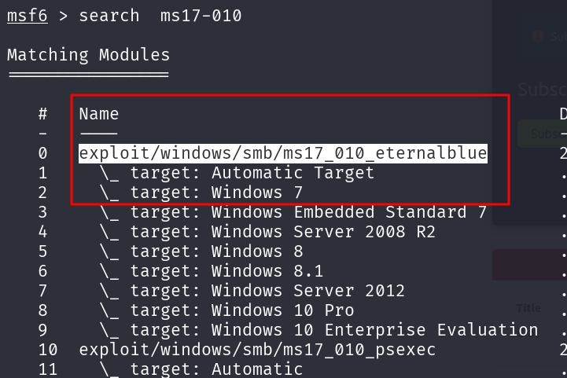
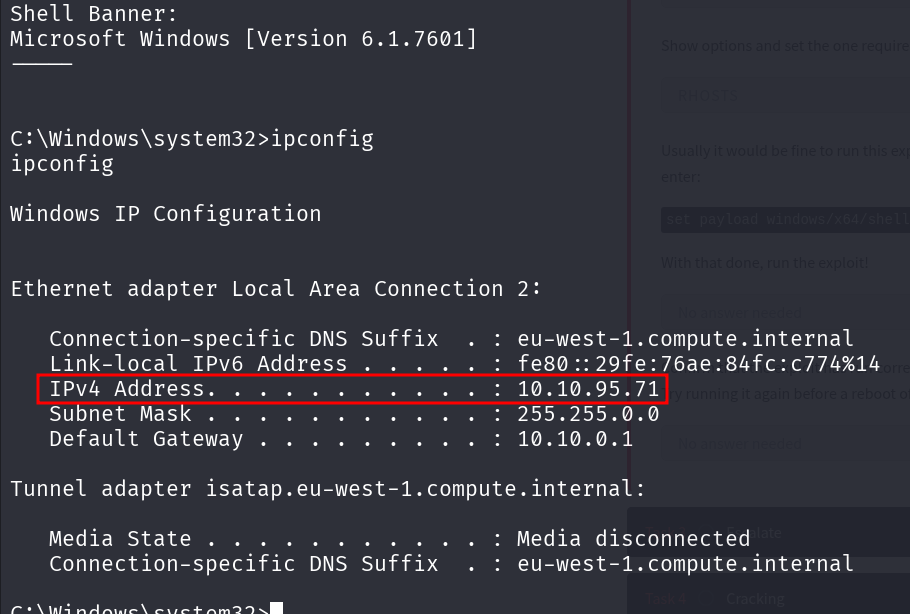
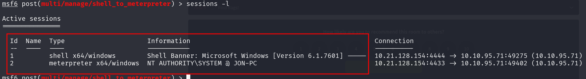

### **Tutorial: Explotación de la vulnerabilidad MS17-010 (EternalBlue) en THM**
 
 ---

 **Paso 1: Escaneo de puertos con Nmap**
 
 Ejecutamos el siguiente comando para escanear los servicios en la máquina objetivo:
 
 
 
 **Nota:** EternalBlue es una vulnerabilidad en Microsoft Windows explotada por la NSA antes de ser revelada públicamente. Permite a un atacante obtener acceso remoto a computadoras vulnerables.
 
 En el escaneo, encontramos **3 puertos abiertos por debajo de 1000**.
 
 
 
 ---
 
 **Paso 2: Buscar y seleccionar el exploit en Metasploit**
 
 Ejecutamos **msfconsole** y buscamos el exploit para la vulnerabilidad MS17-010 con:
 
 
 
 La ruta completa del código del exploit es:
 
 
 
 Seleccionamos el exploit con:
 
 Después, configuramos el payload:
 
 Mostramos las opciones con:
 
 
 
 ---
 
  **Paso 3: Configurar parámetros y ejecutar el exploit**
 
 Definimos la IP de la máquina víctima:
 
 
 
 Definimos nuestra IP en la VPN de THM:
 
 
 
 Ejecutamos el exploit:
 
 
 
 
 Una vez dentro de la máquina víctima, verificamos la IP con:
 
 
 
 Colocamos la sesión en segundo plano con:
 
 
 
 
 Revisamos las sesiones activas:
 
 
 
 Ingresamos a Meterpreter con:

 
 
 Ahora que tenemos privilegios elevados, ejecutamos:

 
 
 Copiamos el hash y lo crackeamos en **Crackstation.net**.
 
 
 
 Contraseña obtenida: **alqfna22**
 
 ---
 
 **Paso 4: Obtención de las flags**
 
 **Primera Flag**
 
 Nos movemos a la raíz del sistema:
 
 
 
 
 
 Leemos la flag:
 
 
 Flag obtenida: **1/3**
 
 ---
 
**Segunda Flag**
 
 Nos dirigimos a la nueva ruta indicada:
 
 
 
 Leemos la flag:
 
 
 
 Flag obtenida: **2/3**
 
 ---
 
 **Tercera Flag**
 
 Vamos a la ruta indicada:
 
 
 
 Leemos la flag:
 
 
 
 Flag obtenida: **3/3**
 
 ---
 
**Conclusión**
 
 Hemos completado la explotación de la máquina **BLUE** en TryHackMe, utilizando **EternalBlue (MS17-010)** para obtener acceso, escalar privilegios y extraer información clave.
