# **Guía Paso a Paso: Explotación de Fuel CMS para Obtener Acceso a un Sistema**

Si este documento se parece a algunos de mis compañeros es porque la hicimos todos en clase.

---
# **Buscando la 1 Flag**
## Paso 1: Identificar la vulnerabilidad en Fuel CMS

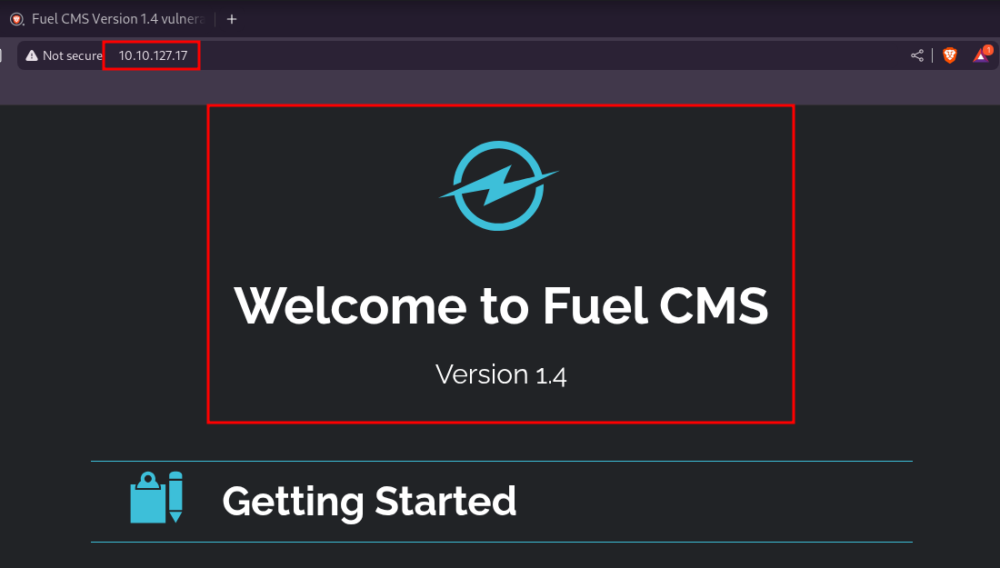

Vemos que Fuel CMS versión 1.4 está corriendo en el servidor con la IP 10.10.127.17. La página principal es accesible, pero el navegador indica que no es segura, lo que sugiere posibles vulnerabilidades

## Paso 2: Buscar Exploit para la Vulnerabilidad en Fuel CMS

Usamos searchsploit para encontrar vulnerabilidades en Fuel CMS 1.4. Se identifica un exploit (ID 50477.py) para Ejecución Remota de Código (RCE) en la versión 1.4.1

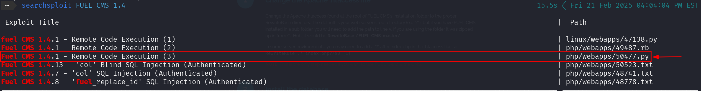

Ruta del exploit en Kali Linux:

## Paso 3: Ejecutar el Exploit

Ejecutamos el exploit con el siguiente comando:

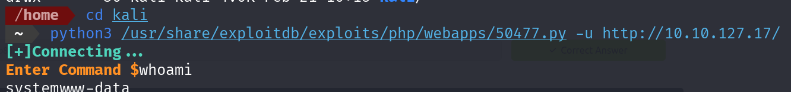

Obtenemos acceso al sistema como usuario www-data

## Paso 4: Explorar el Sistema Comprometido

Listamos archivos y directorios en el sistema comprometido:

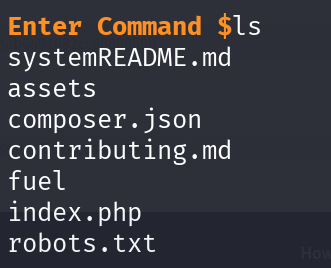

Encontramos archivos clave como index.php, robots.txt, y la carpeta fuel

## Paso 5: Obtener la Primera Bandera

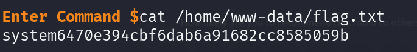

Accedemos y leemos el contenido de /home/www-data/flag.txt:

# **Buscando la 2 Flag**

## Paso 6: Descargar el Reverse Shell PHP desde GitHub

Descargamos un reverse shell PHP de Pentestmonkey en GitHub y modificamos las siguientes líneas:

En ip y port ponemos la ip de la VPN de tryhackme

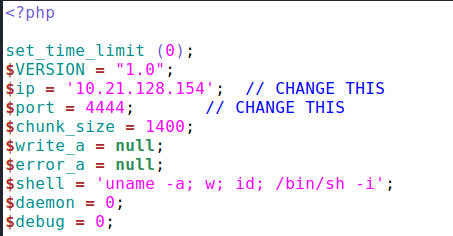

URL del repositorio: https://github.com/pentestmonkey/php-reverse-shell

## Paso 7: Servir el Reverse Shell PHP

Iniciamos un servidor HTTP en nuestra máquina local:

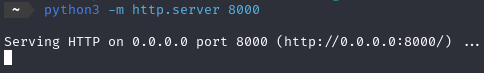

## Paso 8: Descargar el Reverse Shell en el Sistema Comprometido

En el servidor comprometido, descargamos el archivo:

aqui lo que he hecho es que en la terminal le digo que descargue el fichero de la reverse shell a la pagina del cms.

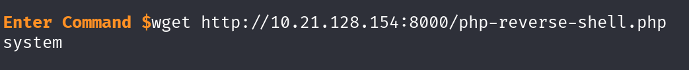

## Paso 9: Ejecutar el Reverse Shell PHP en el Sistema Comprometido

Ejecutamos el reverse shell:

Perfecto ya tenenmos el fichero que nos va dar acceso total a la terminal de la pagina. 

Con este comando ejecutamos la shell, Ahora abrimos un puerto de escucha en el  4444 y veremos que podremos acceder a la terminal.

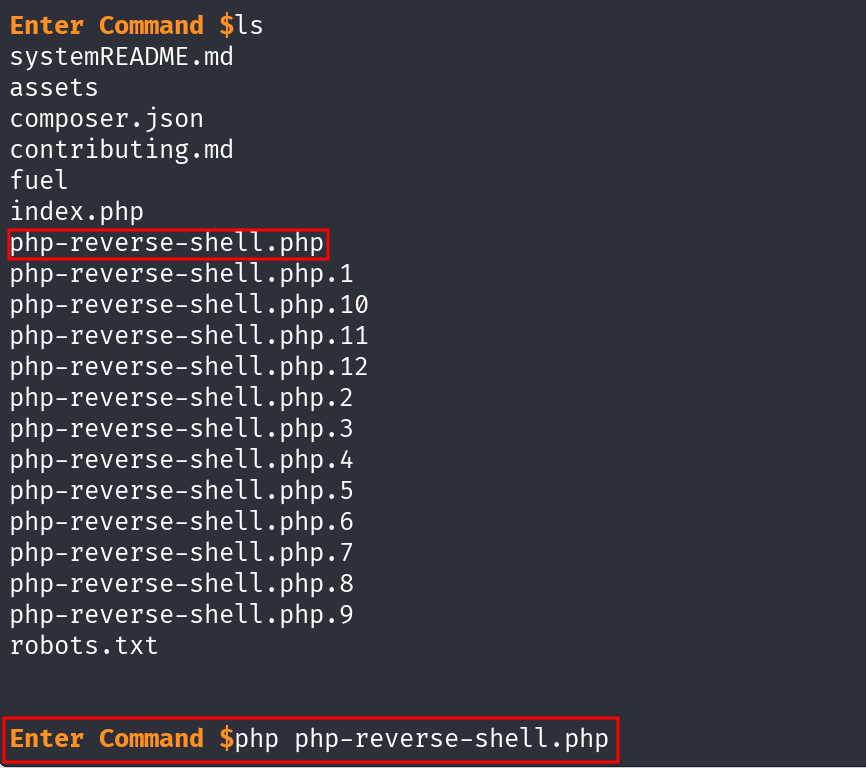

## Paso 10: Recibir la Conexión Inversa

En nuestra máquina local, escuchamos con Netcat:

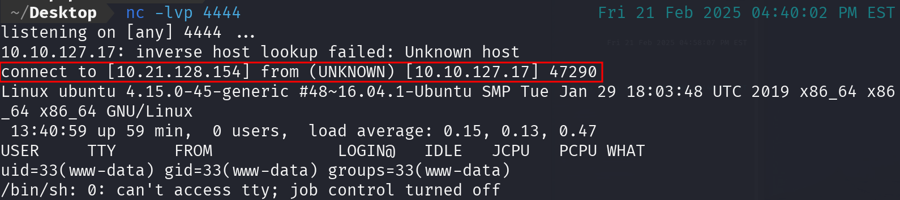

## Paso 11: Mejorar la Shell con Python

Como esta shell es poco intuitiva ponemos este comando para que sea mas agradable al manejar la shell

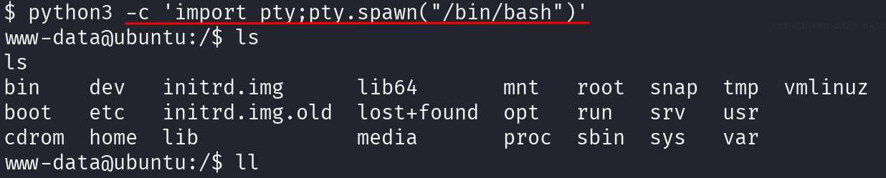

## Paso 12: Buscar Archivos Relacionados con la Base de Datos

Encontramos el archivo de configuración de la base de datos:

Ruta: `/var/www/html/fuel/application/config/database.php`

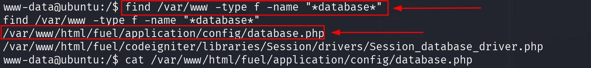

## Paso 13: Leer el Contenido del Archivo database.php

Obtenemos las credenciales de la base de datos:

Credenciales: Usuario: root, Contraseña: mememe

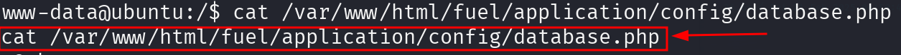

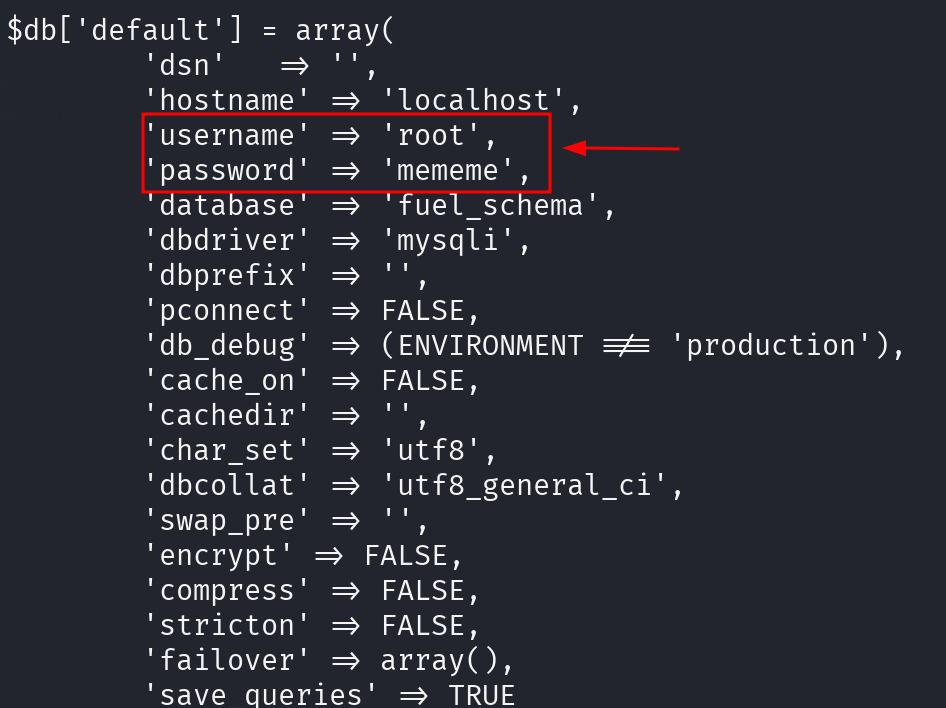

## Paso 14: Escalar Privilegios a Root

Escalamos privilegios usando:

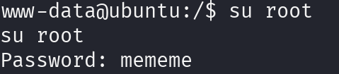

Ingresamos la contraseña: mememe

## Paso 15: Leer la Bandera Final

Accedemos a la bandera final:

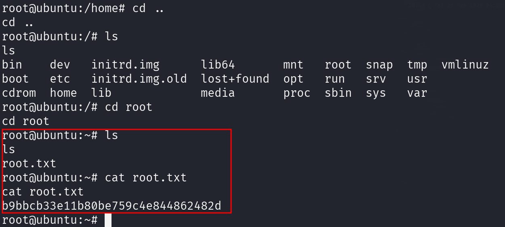

---

# **Finalmente tenemos las dos flags de maquina de THM**