# **Guía Paso a Paso: Explotación de Techsupp0rt1**

Esta maquina se me hizo algo complicada a la hora de explotarla.

## Paso 1: Exploración y escaneo de puertos
Lo primero que hice fue realizar un escaneo de puertos utilizando Nmap para identificar los servicios activos en la máquina de destino.

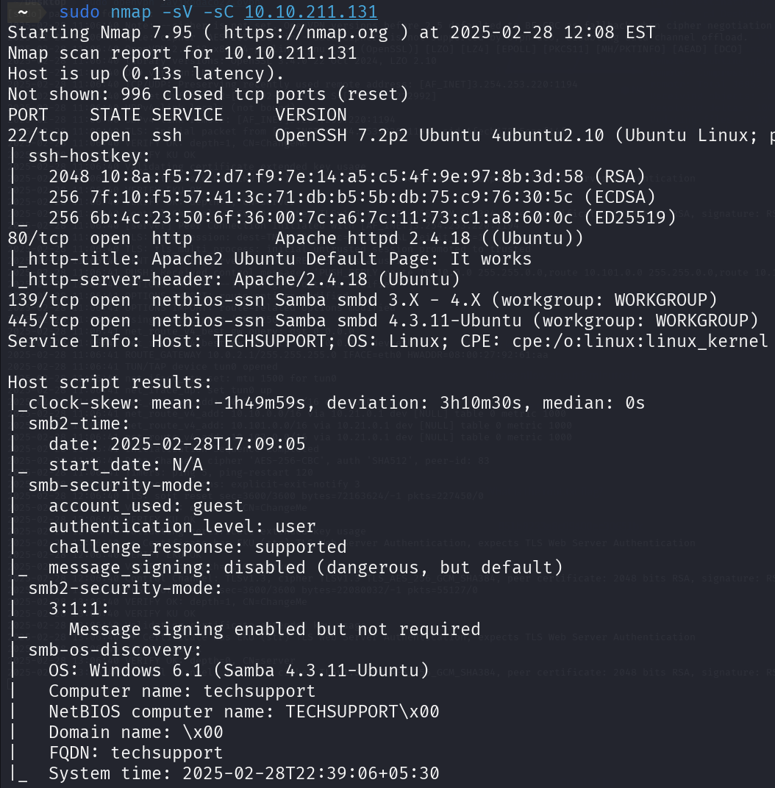

Los resultados mostraron que la máquina tenía los siguientes puertos abiertos:

La máquina está corriendo Ubuntu y tiene el nombre de host "TECHSUPPORT". También se observó que la autenticación SMB está configurada para usar la cuenta "guest" con nivel de acceso "user".

## Paso 2: Análisis del servicio web
Después de identificar que el puerto 80 estaba abierto, utilicé Gobuster para realizar un escaneo de directorios en el servidor web, utilizando el siguiente comando:

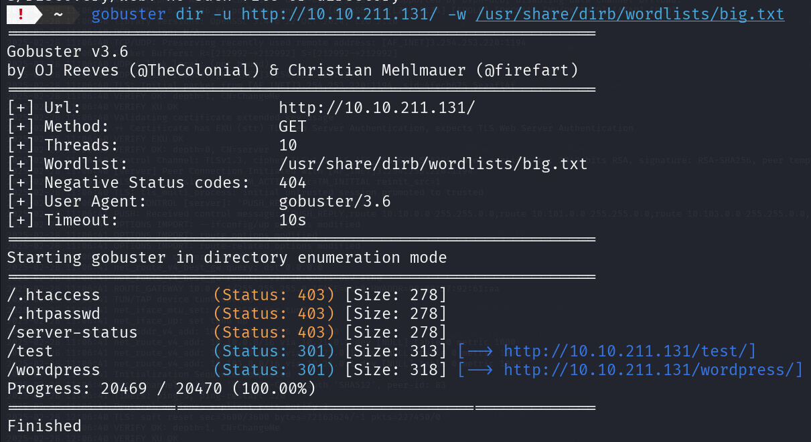

La redirección a /wordpress sugiere que podría haber una instalación de WordPress en el servidor, lo que abre la posibilidad de buscar vulnerabilidades asociadas a esa plataforma.

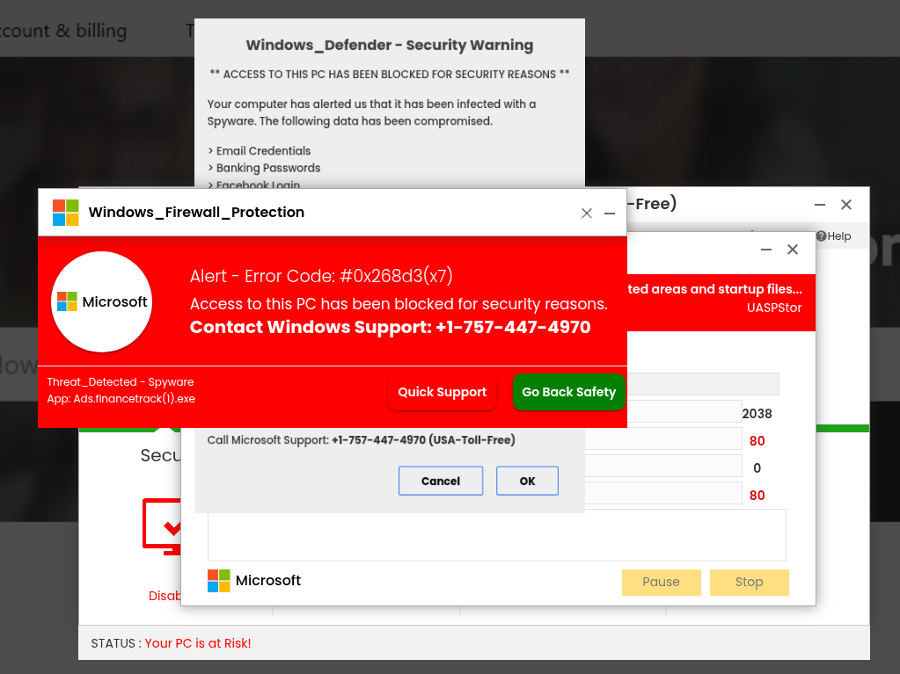

## Paso 3: Análisis de SMB
Después de explorar el servicio web, decidí investigar el servicio SMB ya que los puertos 139 y 445 estaban abiertos en el escaneo de Nmap. SMB (Server Message Block) es un protocolo utilizado para compartir archivos e impresoras en redes locales, y en este caso, la máquina de destino tiene Samba habilitado, lo que permite la comunicación SMB en sistemas Linux.

Utilicé smbclient para listar los recursos compartidos en la máquina de destino. El comando que ejecuté fue:

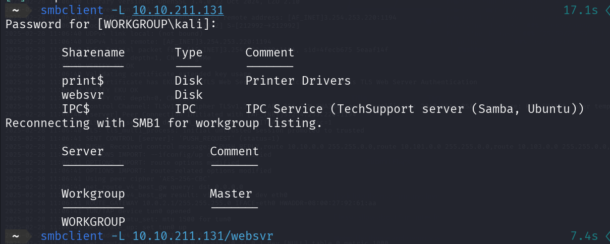

# Paso 4: Acceso a archivos SMB
Tras acceder al recurso compartido websvr en el servidor de destino, utilicé el siguiente comando smbclient para explorar el contenido del recurso:

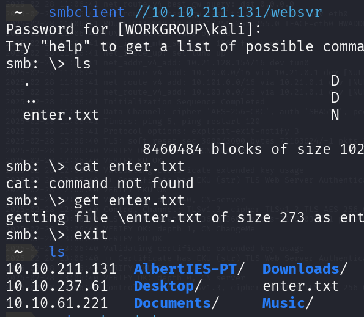

Una vez dentro, usé el comando ls para listar los archivos disponibles en el recurso y encontré el archivo enter.txt. Intenté leer su contenido usando el comando cat, pero cat no funcionó, ya que no está disponible en smbclient. Entonces, utilicé el comando get para descargar el archivo:

Descargué el archivo de 273 bytes y luego lo guardé en mi máquina local paraver su contenido.

## Paso 5: Descifrado de credenciales y análisis
Al revisar el contenido de enter.txt, encontré una credencial importante para Subrion:

La contraseña de Subrion parecía estar cifrada. Para investigarlo, pasé la clave a base58, luego la convertí a base32, y finalmente la decodifiqué a base64 utilizando los siguientes comandos:

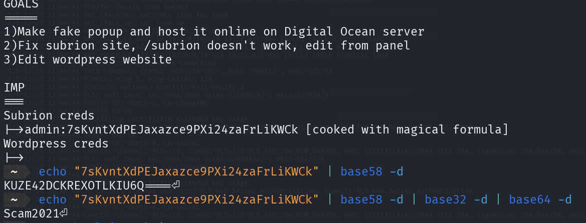

Este proceso me permitió descifrar la clave y obtener las credenciales de acceso a Subrion.

Dato importante a tener cuenta, Subrion es un tipo Sistema de Gestión de Contenidos (CMS) gratuito y de código abierto basado en PHP y MySQL.

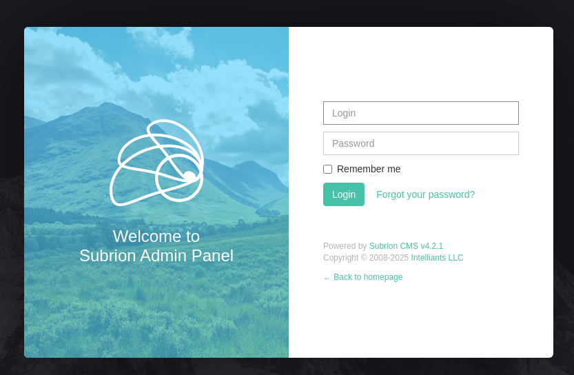

## Paso 6: Investigación de vulnerabilidades en Subrion
Al investigar más sobre Subrion, utilicé Searchsploit para buscar posibles vulnerabilidades en el CMS. Los resultados mostraron varias vulnerabilidades conocidas en diferentes versiones de Subrion.

Subrion CMS 4.2.1 - Arbitrary File Upload: Esta vulnerabilidad permite la carga arbitraria de archivos, lo que podría ser aprovechado para ejecutar código malicioso en el servidor.

Lo que hice fue descargar ese exploit usando el comando que se muenstra en la imagen

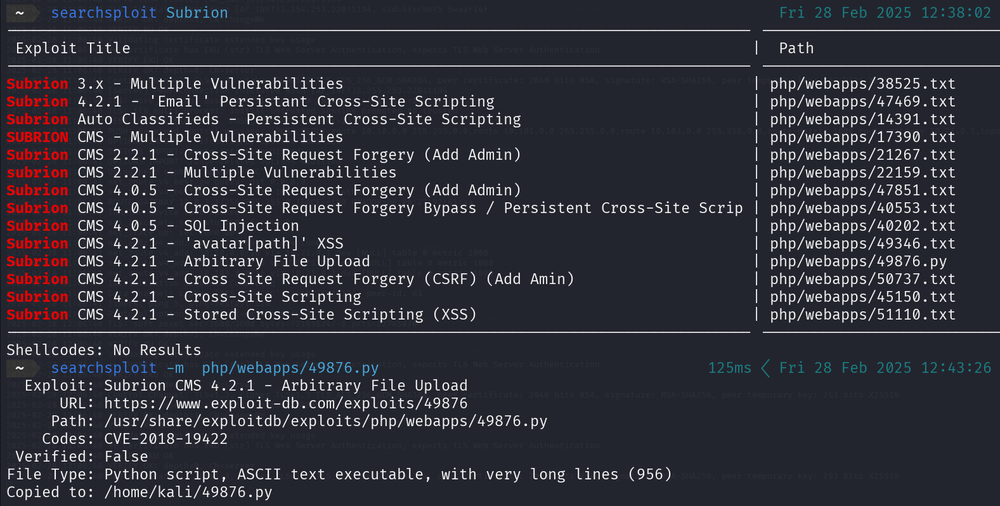

## Paso 7: Ejecución del exploit con Python
Tras investivagar un poco de como se puede usar ese exploit (ChatGPT). Utilice el script 49876.py para explotar la vulnerabilidad de carga arbitraria de archivos, lo que permitió cargar una webshell en la máquina de destino. Aquí están los detalles del proceso:

Conexión con el servidor: El exploit intenta conectarse a la URL del panel de administración de Subrion CMS en la máquina de destino.

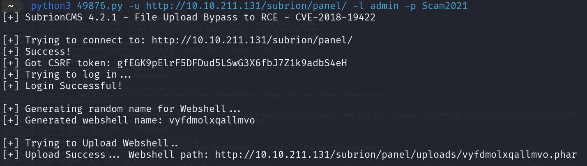

Aqui ya tendriamos accesso a la shell.

## Paso 8: Acceso al archivo wp-config.php

Como la página es un sitio web basado en WordPress, el archivo wp-config.php de WordPress contiene información sensible, como las credenciales de acceso a la base de datos.

Aqui si miramos muy bien vemos que tiene algo muy interesante.

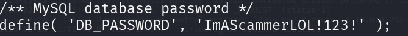

Importante antes de continuar se me olvido hacerle captura a los usuarios de la maquina 

Simplente en el esta misma shell ejecute el comando ls -lsa para listar los usuarios del sistema, aqui saque el usuario **scamsite** que nos sera importante para este ultimo paso.

## Paso 9: SHH y Escalada de privilegios usando iconv

Ya con nombre de la maquina y el usuario vamos a probar a entrar por ssh, porque como vimos en el rimer paso el puerto 22 estaba abierto vamos a prbar si hay suerte.

Hemos entrado sin problemas.

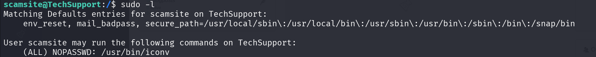

El comando sudo -l se usa para listar los permisos de sudo de un usuario en particular.

Me salio eso y pues no tenia ni idea de como seguir asque le pregunte a mi amigo chatGPT para ver como se puede explotar.

En resumida cuenta es usar este comando.

Aqui simplemte sacamos las flag y ya tendriamos la maquina hecha.