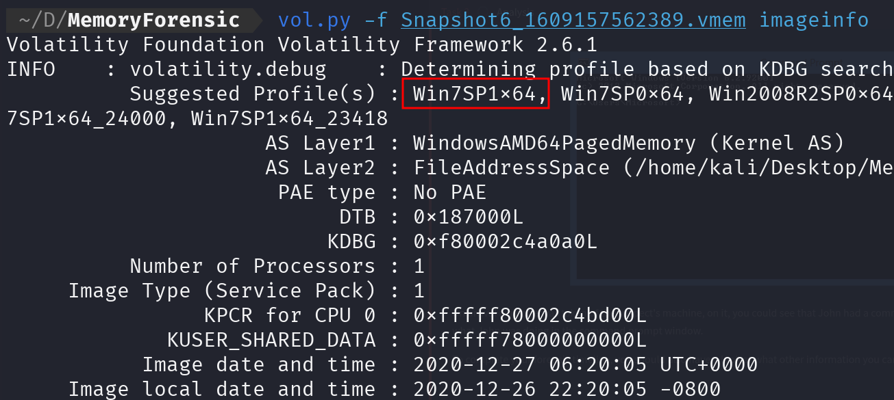
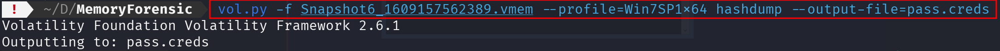
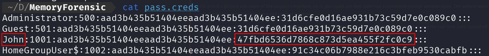
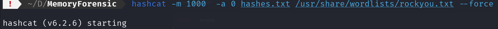
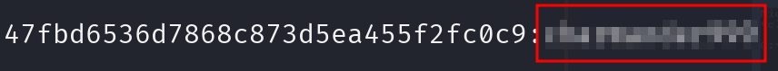
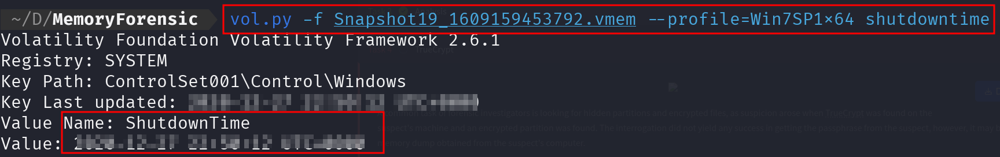
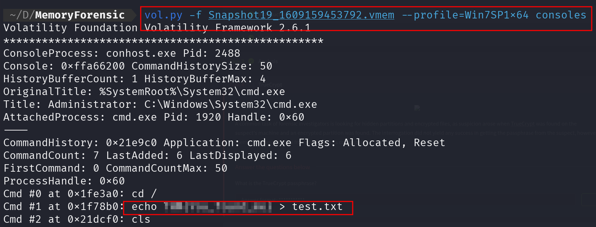
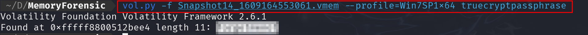

Aquí tienes el **write-up** detallado de la room de TryHackMe, explicando cada paso con las imágenes.  

---

# **Write-up: Análisis Forense de Memoria en TryHackMe**

## **Introducción**
En este write-up, documentaré mi proceso de análisis forense de memoria utilizando **Volatility** y **Hashcat**. El objetivo era extraer credenciales, analizar la actividad del sistema y encontrar evidencias en una imagen de memoria de un sistema **Windows 7 SP1 x64**.

---

## **Paso 1: Identificación del perfil del sistema**

Lo primero que hice fue determinar el perfil del sistema con el siguiente comando:

```bash
vol.py -f Snapshot6_1609157562389.vmem imageinfo
```

Este comando analiza la memoria y sugiere perfiles compatibles. Como resultado, el perfil recomendado fue **Win7SP1x64**, lo cual es crucial para ejecutar los demás módulos de Volatility correctamente.

---

## **Paso 2: Extracción de hashes de credenciales**
  
Usando el perfil identificado, ejecuté **hashdump** para extraer los hashes de contraseñas almacenados en memoria:

```bash
vol.py -f Snapshot6_1609157562389.vmem --profile=Win7SP1x64 hashdump --output-file=pass.creds
```

Esto me permitió volcar las credenciales en un archivo llamado **pass.creds**, donde encontré los hashes de varios usuarios.

---

## **Paso 3: Análisis de los hashes extraídos**

Al visualizar el contenido del archivo **pass.creds** con:

```bash
cat pass.creds
```
Identifiqué los hashes NTLM de diferentes usuarios, en particular el del usuario **John**:

```
John:1001:aad3b435b51404eeaad3b435b51404ee:47fbd6536d7868c873d5ea455f2fc0c9:::
```

Aquí, el segundo hash corresponde al **NTLM hash**, el cual podía intentar crackear.

---

## **Paso 4: Crackeo del hash NTLM con Hashcat**

Para recuperar la contraseña del usuario **John**, usé **Hashcat** con la wordlist **rockyou.txt**:

```bash
hashcat -m 1000 -a 0 hashes.txt /usr/share/wordlists/rockyou.txt --force
```

- `-m 1000` → Especifica que estamos crackeando un hash **NTLM**.  
- `-a 0` → Define un ataque de **diccionario**.  
- `hashes.txt` → Archivo donde guardé el hash extraído.  
- `/usr/share/wordlists/rockyou.txt` → Lista de contraseñas de RockYou.  
- `--force` → Obliga a ejecutarse si hay advertencias de compatibilidad.

---

## **Paso 5: Obtención de la contraseña**
 
Después de unos minutos, **Hashcat** logró crackear la contraseña asociada al usuario **John**, confirmando así la autenticidad del hash extraído de la memoria.

---

## **Paso 6: Identificación del último apagado del sistema**
 
Para determinar cuándo fue la última vez que se apagó el sistema, utilicé:

```bash
vol.py -f Snapshot19_1609159453792.vmem --profile=Win7SP1x64 shutdowntime
```

Este comando extrae la clave del registro **ShutdownTime**, que indica la última vez que el sistema fue apagado.

---

## **Paso 7: Análisis de la actividad de la consola**
 
Para ver qué comandos se ejecutaron en la consola de Windows antes de la captura de memoria, utilicé:

```bash
vol.py -f Snapshot19_1609159453792.vmem --profile=Win7SP1x64 consoles
```

Pude ver que el usuario **John** ejecutó comandos como:
```bash
echo [XXXXXX] > test.txt
```
Esto indica que pudo haber almacenado información sensible en un archivo llamado **test.txt**.

---

## **Paso 8: Recuperación de la contraseña de TrueCrypt**
  
Para encontrar una posible contraseña de **TrueCrypt**, usé:

```bash
vol.py -f Snapshot14_1609164553061.vmem --profile=Win7SP1x64 truecryptpassphrase
```

Esto reveló una **contraseña de 11 caracteres** almacenada en memoria, lo que podría permitir el acceso a un volumen encriptado.
