# Esta practica de memoria la hemos hecho en clase, pero como me perdi tuve que volverla hacer.

## Buscamos 3 flags en esta memoria ram.

## Paso 1 - Hacemos un imageinfo

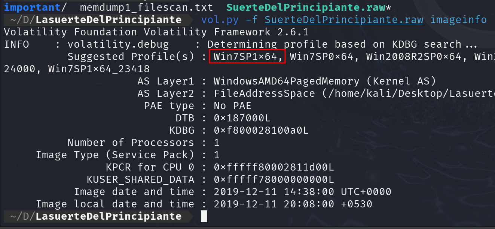

Este es esl perfil que nos interesapara esta practica.

---
Usando el comando consoles que tiene un codifo cifrado, vamos a prbar a usar base64

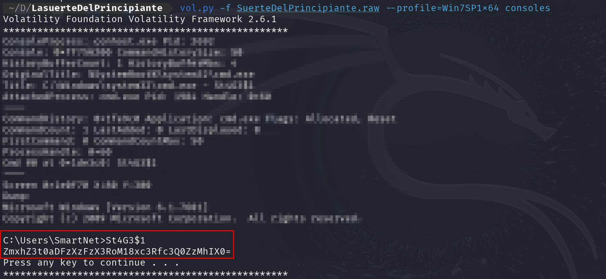

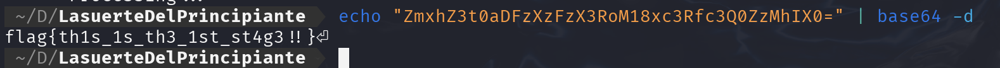

Aqui ya tendriamos la 1 Flag.

## Paso 2 - Vamos ha usar a hashdump 

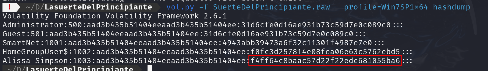

Aqui tenemos la contrasela cifrada en NTML, En este caso voy a ir a crackstatation para crackearla

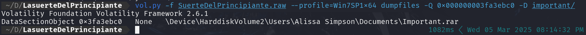

NoS guardamos el archivo de ese proceso y lo pasamos a esa carpeta

luego vamos a esa carpeta cambiamos el formati a .rar y vamos a extraerlo nos pide una contraseña pero no es la contraseña ya crackeada sino la que nos salio antes con el hashdump pero todo en mayusculas.

presionamos enter y ya tendriamos la 3 Flag

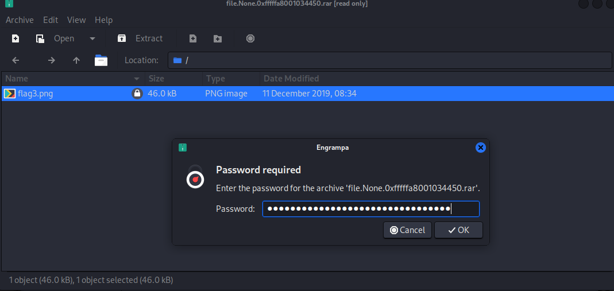

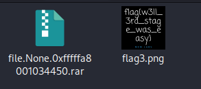

## Paso 3 - Ultima Flag

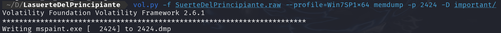

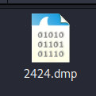

Cambiamos el formato a .data, y con gimp lo abrimos y usando las paletas podemos sacar la 2 Flag.

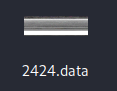

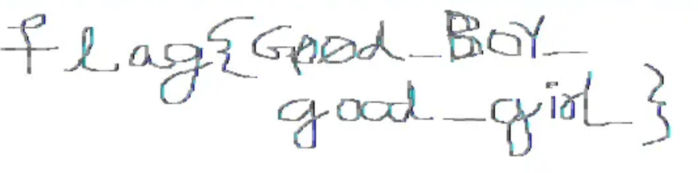